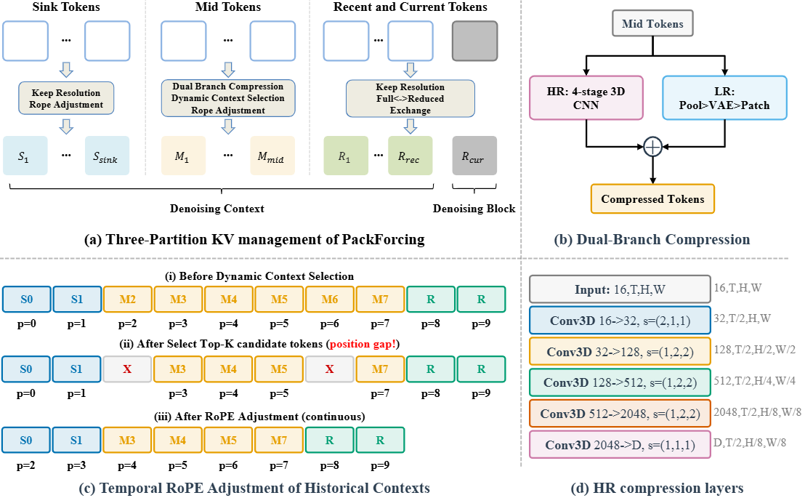

<div align="center">

## PackForcing: Short Video Training Suffices for Long Video Sampling and Long Context Inference

[](https://arxiv.org/abs/2603.23497)&nbsp;

</div>

This repository contains the official implementation and benchmark code for the paper:

> [**PackForcing: Short Video Training Suffices for Long Video Sampling and Long Context Inference**](https://arxiv.org/abs/2603.23497)
>
> Xiaofeng Mao, Shaohao Rui, Kaining Ying, Bo Zheng, Chuanhao Li, Mingmin Chi, Kaipeng Zhang 
> 
> Alaya Studio, Shanda AI Research, Fudan University, Shanghai Innovation Institute

## 💡 Introduction



Autoregressive video diffusion models have demonstrated remarkable progress, yet they remain bottlenecked by intractable linear KV-cache growth, temporal repetition, and compounding errors during long-video generation. 

To address these challenges, we present **PackForcing**, a unified framework that efficiently manages the generation history through a novel three-partition KV-cache strategy:

1. **Sink tokens**: Preserve early anchor frames at full resolution to maintain global semantics.
2. **Mid tokens**: Achieve a massive spatiotemporal compression (~32x token reduction) via a dual-branch network fusing progressive 3D convolutions with low-resolution VAE re-encoding. To bound memory footprint, we introduce a dynamic top-k context selection mechanism.
3. **Recent tokens**: Kept at full resolution to ensure local temporal coherence.

Empowered by this principled hierarchical context compression and a continuous Temporal RoPE Adjustment, PackForcing can generate coherent 2-minute, 832x480 videos at 16 FPS on a single H200 GPU. It achieves a bounded KV cache of just ~4GB and enables a remarkable 24x temporal extrapolation (from 5s to 120s), operating effectively either zero-shot or trained on merely 5-second clips.

## 🎥 Generation Result

<video src="assets/c2cc6abde8b8de5bb3a82681cb840492.mp4" controls="controls" width="100%">
</video>

## 📝 TODO List

- [ ] Release train/inference code
- [ ] Release pre-trained model weights

## 📖 Citation

If you find this project helpful, please consider citing our work:

```bibtex
@misc{mao2026packforcing,
      title={PackForcing: Short Video Training Suffices for Long Video Sampling and Long Context Inference}, 
      author={Xiaofeng Mao and Shaohao Rui and Kaining Ying and Bo Zheng and Chuanhao Li and Mingmin Chi and Kaipeng Zhang},
      year={2026},
      eprint={2603.23497},
      archivePrefix={arXiv},
      primaryClass={cs.CV},
      url={https://arxiv.org/abs/2603.23497}, 
}
```

